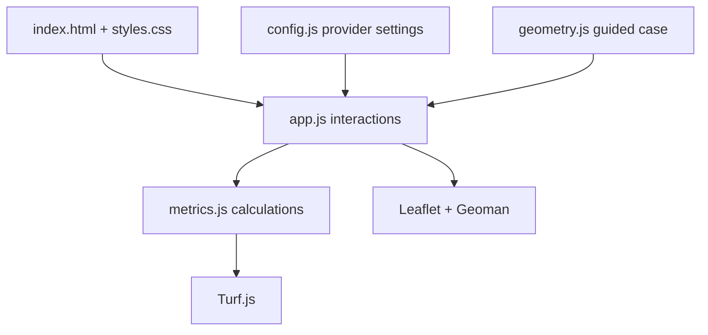

# Architecture and Maintenance

## Design objective

The application is a static instructional tool. It intentionally avoids a framework build chain, backend, database, user authentication, and paid API credentials. GitHub Pages serves the repository files directly.

## Module boundaries



## Basemap replacement

The active basemap is defined only in `src/config.js`:

```js
mapProvider: {
  id: "openstreetmap",
  label: "OpenStreetMap",
  tileUrl: "https://tile.openstreetmap.org/{z}/{x}/{y}.png",
  attribution: "&copy; OpenStreetMap contributors",
  maxZoom: 19
}
```

To replace it, change this object and update `ATTRIBUTION.md`. Prefer a provider that does not require an exposed key or billable account. Confirm usage terms and attribution requirements before publishing.

If map tiles are throttled or unavailable, Leaflet continues to provide a geometry canvas. Drawing and capacity calculations remain client-side.

## Dependency replacement

Pinned third-party browser files are declared near the top of `index.html`. Change one dependency at a time and test:

1. initial guided geometry;
2. drawing a site and a building;
3. vertex editing, moving, rotating, and deleting;
4. setback and capacity recalculation;
5. reset behavior;
6. keyboard and pointer access to definitions; and
7. desktop and mobile layout.

## Calculation boundary

`src/metrics.js` is the only module that computes planning measures. The UI should display results returned by that module rather than duplicate formulas elsewhere.

The simplified physical capacity is:

`min(buildable area, site area × maximum coverage) × stories`

The FAR capacity is:

`site area × maximum FAR`

The smaller of these is identified as the likely binding constraint. This is a teaching comparison, not a complete zoning analysis.

## Deployment

`.github/workflows/pages.yml` publishes the static repository through GitHub Pages after changes to `main`. The project uses no GitHub Actions build dependencies beyond GitHub's official Pages actions.
